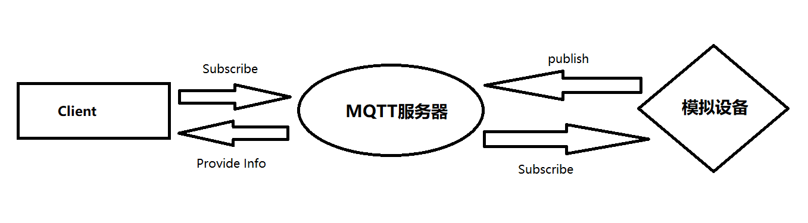

[toc]

# 1 引言

## 1.1 编写目的

本文档是基于实验目的和实验要求，在分析需求之后，规定的系统设计结构以及相关细节。

本文档通过引言、需求功能分析、运行环境、系统结构设计、数据处理及相关对应的系统实现对读者阐述本系统规定的设计计划，明确本系统的系统概貌、体系设计等。便于后续开发参考。

## 1.2 背景

智能家居最初的定义是：“将家庭中各种与信息相关的通信设备、家用电器和家庭安防装置，通过家庭总线技术（HBS）连接到一个家庭智能系统上，进行集中或异地监视、控制和家庭事务性管理，并保持这些家庭设施与住宅环境和谐与协调”。在这样的智能家居中，HBS是智能住宅的基本单元也是智能住宅的核心。

随着科学技术的不断进步和社会的发展，目前智能家居定义也逐渐演变成了“以住宅为平台，利用综合布线技术、网络通信技术、安全防范技术、自动控制技术、音视频技术将家居生活有关的设施集成，构建高效的住宅设施与家庭日常事务的管理系统，提升家居安全性、便利性、舒适性、艺术性，并实现环保节能的居住环境”。

本系统作为一个智能家居管理系统，基于 B/S 结构设计，通过实现智能家居管理的基本功能，实现指定的创建管理智能设备功能。

# 2 系统设计

## 2.1 需求分析

### 2.1.1 实验要求

需要实现的基本功能如下：

+ 实现用户注册、登录功能，用户注册时需要填写必要的信息并验证，如用户名、密码要求在6字节以上，手机号的格式验证，并保证用户名和手机号在系统中唯一，用户登录后可以进行以下操作。
+ 用户登录后可以创建场所，然后在场所里创建智能设备（中间可以加一级，就是场所里先创建房间，然后在房间里创建智能设备）
+ 设备类型至少支持以下几种
  + 灯（支持开关和亮度调节）
  + 开关
  + 传感器（温湿度等信息查看）
  + 门锁（开关门状态上报）
+ 提供列表信息查看设备信息、设备状态和上报信息
+ 提供可视化界面展示以上信息，可以在房间户型图（上传图片）上摆放设备，或者提供画图功能画出场所图
+ 可以在手机上查看，手机应用可以是网页，也可以是app

### 2.1.2 功能解析

+ 对服务器发布的信息进行信息获取和储存
+ 实现用户注册登录功能
+ 用户可以查看或删除设备
+ 用户可以查看设备的状态
+ 用户可以通过户型图设置设备位置

## 2.2 运行环境

### 2.2.1 软件层面

本网站要求提供一定的负载能力，保证至少100人次同时访问。包括数据存储能力、网络服务吞吐能力，数据安全特性等。系统需要兼容手机端查看。提供对外服务所要求的相应的安全保障。

本网站浏览器需使用 IE、Chrome 等常见的浏览器进行访问，但也支持其余浏览器体验。

### 2.2.2 硬件层面

硬件层面的要求如下：

+ CPU：主频大于 2 GHz
+ 硬盘：硬盘熔炼大于 200 GB、硬盘转速大于等于 5400 转/分钟
+ 其余硬件满足正常的使用需求即可

## 2.3 系统功能模块设计

**用户模块**

+ 用户管理模块
  + 登录
  + 修改密码
  + 查看个人信息
  + 修改个人信息
  + 登出
  
+ 场景管理模块
  + 创建场景

+ 设备管理模块

  + 查看设备状态
  + 查看设备信息
  + 修改设备状态
  + 新建、删除设备
  
## 2.4 系统结构设计

**Client**

+ 与用户直接交互
+ 展示 MQTT服务器内容
  

**MQTT服务器**

+ 接收模拟设备发送的信号, 转送信号给 Client
+ 与 Client 通信
+ 与数据库通信

**模拟设备**

+ 发布模拟信号

## 2.5 技术栈选择

### 2.5.1 客户端

选用 VUE 作为前端框架

### 2.5.2 服务器

基于Python 的 Flask 框架

### 2.5.3 数据库

mySQL

# 3 数据模型

**用户信息**

| 字段名   | 类型        | 描述          |
| -------- | ----------- | ------------- |
| userId   | int         | 唯一ID 主键   |
| userName | varchar(30) | 用户昵称 非空 |
| phone    | varchar(30) | 电话号码 唯一 |
| password | varchar(30) | 密码          |

**场景信息**

| 字段名 | 类型 | 描述 |
| -------- | --------- | ------------- |
| sceneId | int | 唯一场景ID 主键 |
| sceneName | varchar(30) | 场景名称 |
| userId | int | 场景的所有者 |

**设备信息**

| 字段名     | 类型        | 描述            |
| ---------- | ----------- | --------------- |
| deviceId   | int         | 唯一设备ID 主键 |
| deviceName | varchar(30) | 设备名称        |
| sceneId    | int         | 设备所属场景ID  |
| userId     | int         | 设备所属用户ID  |
